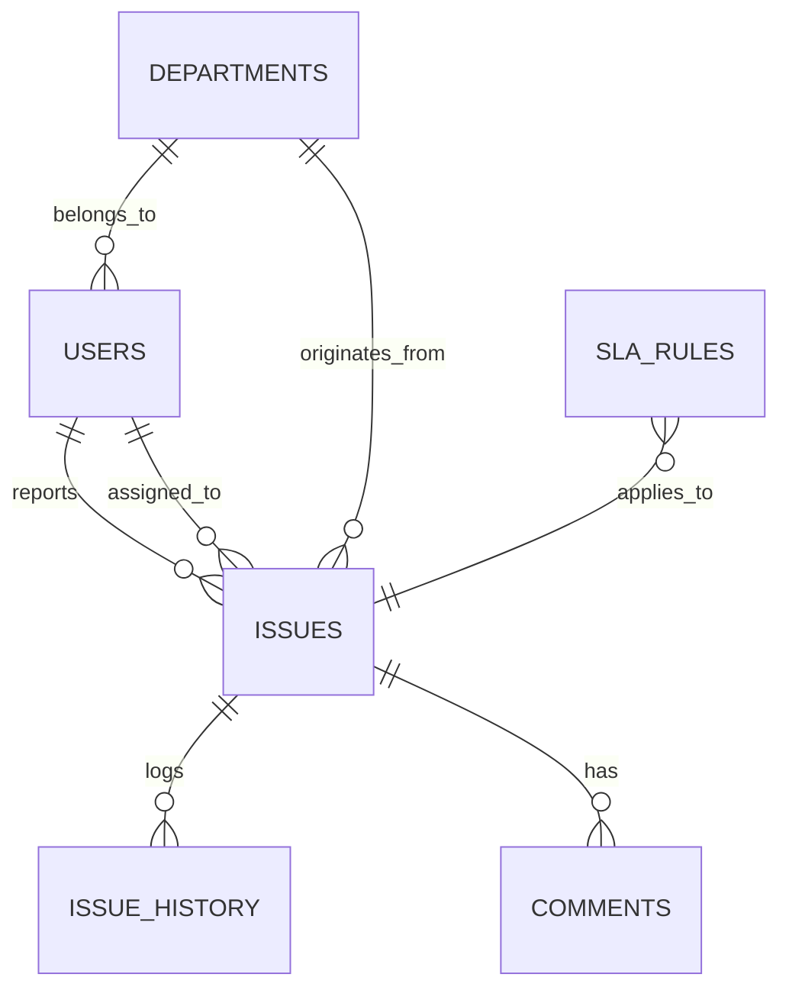

# Enterprise Business Analysis & Issue Tracking System

[](https://reactjs.org/)
[](https://fastapi.tiangolo.com/)
[](https://www.postgresql.org/)
[](https://pandas.pydata.org/)

An enterprise-grade operational issue tracking platform designed to showcase Business Intelligence (BI), Business Analysis (BA), and full-stack software development skills.

---

## 1. Project Overview
This project is a realistic enterprise web application designed to help medium-to-large companies manage operational issues, monitor business processes, track Service Level Agreement (SLA) performance, and generate actionable management insights via a KPI dashboard. 

## 2. Business Problem
Employees across various departments frequently encounter operational issues (IT, Process, HR, Finance). Currently, these are tracked manually through fragmented emails and spreadsheets, leading to:
* **Lack of Visibility:** Management cannot see bottlenecks or departmental workloads.
* **SLA Breaches:** Critical issues fall through the cracks without automated tracking.
* **No Process Insights:** Recurring problems are not identified, preventing root-cause analysis.

## 3. Objectives
To replace the manual tracking system with a centralized platform that:
* Registers, assigns, and tracks issues through their entire lifecycle.
* Automatically calculates SLA targets and flags breaches based on business priority.
* Provides real-time BI dashboards to support data-driven management decisions.

## 4. Key Features
* **Role-Based Access Control (RBAC):** Distinct workflows for Employees, Support Agents, and Managers.
* **Automated SLA Tracking:** Priority-based resolution targets (Critical: 4h, High: 24h, Medium: 72h, Low: 7 days).
* **Process History Logging:** Every status change and reassignment is logged for process mining and auditability.
* **BI Management Dashboard:** Real-time calculation of resolution rates, average handling time, and departmental bottlenecks.

## 5. Business Analysis Approach
The system was designed following standard BA methodologies:
* **Requirement Elicitation:** Identified the need for centralized tracking and reporting.
* **Process Modeling:** Mapped the issue lifecycle (Open -> In Progress -> Resolved).
* **KPI Definition:** Defined metrics that matter to stakeholders (Avg Resolution Time, Breach Rate, Departmental Volume).
* **Data-Driven Insights:** Used Pandas on the backend to aggregate raw transactional data into meaningful business insights.

## 6. Technology Stack
* **Frontend:** React, TypeScript, Tailwind CSS, Recharts, Vite
* **Backend:** Python, FastAPI, SQLAlchemy, Alembic, Pandas (for analytics)
* **Database:** PostgreSQL
* **Infrastructure:** Docker, Docker Compose

## 7. System Architecture
The application uses a separated, multi-tier architecture:
1. **Presentation Layer:** React SPA providing a rich, responsive interface.
2. **Business Logic Layer:** FastAPI REST API handling authentication, CRUD operations, and complex SLA calculations.
3. **Analytics Engine:** Pandas integrated within the backend to process SQL queries into optimized aggregations for Recharts.
4. **Data Layer:** Normalized PostgreSQL database ensuring data integrity.

## 8. Database Architecture
The database is fully normalized (3NF) to prevent data anomalies and optimize analytical querying. Key tables include `Users`, `Departments`, `Issues`, `IssueHistory` (for audit logs), and `SLARules`.

## 9. ERD


## 10. API Documentation
The API follows RESTful design principles. Key endpoints:
* `POST /auth/login` - JWT generation
* `GET /issues` - Retrieve issues (filtered by role)
* `POST /issues` - Create new issue and calculate SLA due date
* `GET /dashboard/kpis` - Pandas-aggregated KPI metrics
* `GET /dashboard/trends` - Daily issue volume time-series data

*(Interactive Swagger UI available at `http://localhost:8000/docs` when running locally)*

## 11. Dashboard & KPIs
The dashboard answers critical business questions:
* *Which department has the most issues?* (Bar Chart)
* *Are operational issues increasing?* (Trend Line Chart)
* *What is our SLA compliance?* (KPI Cards)

## 12. Screenshots
*(Placeholder for actual application screenshots)*
- **Manager Dashboard:** Shows Recharts visualizations.
- **Issue Kanban/List:** Shows SLA status badges.
- **Issue Details:** Shows history and comments.

## 13. Installation
1. Clone the repository:
   ```bash
   git clone https://github.com/yourusername/enterprise-issue-tracker.git
   cd enterprise-issue-tracker
   ```
2. Ensure Docker and Docker Compose are installed.

## 14. Environment Variables
Copy the example environment file:
```bash
cp backend/.env.example backend/.env
```
*(The defaults are pre-configured for local Docker testing)*

## 15. Running the Project
To launch the entire stack (Database, Backend, Frontend):
```bash
docker-compose up --build
```
* **Frontend:** http://localhost:5173
* **Backend API:** http://localhost:8000
* **Swagger Docs:** http://localhost:8000/docs

## 16. Demo Accounts
The database is automatically seeded with realistic data for BI visualization. Use these credentials to test different roles:
* **Manager:** `manager@example.com` / `manager123`
* **Agent:** `agent@example.com` / `agent123`
* **Employee:** `employee@example.com` / `employee123`

## 17. Testing
Backend tests are written using `pytest`.
```bash
cd backend
pytest
```

## 18. Future Improvements
* Export reports to CSV/PDF.
* Implement email notifications for SLA breaches.
* Add predictive analytics for issue volume forecasting.

## 19. Author
Developed as a portfolio project showcasing Business Analysis, Data Analytics, and Software Engineering.
